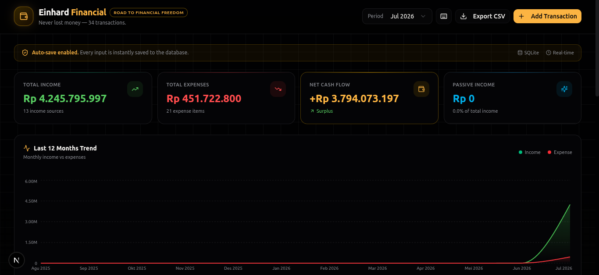
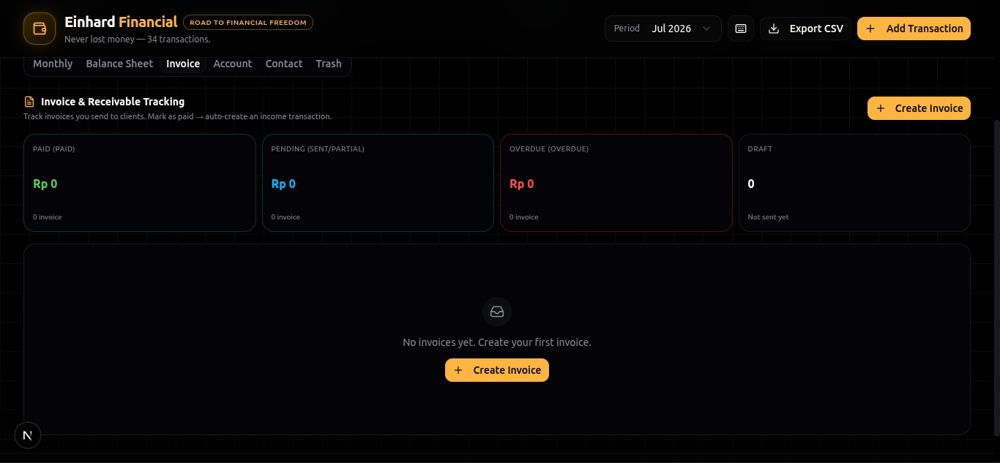
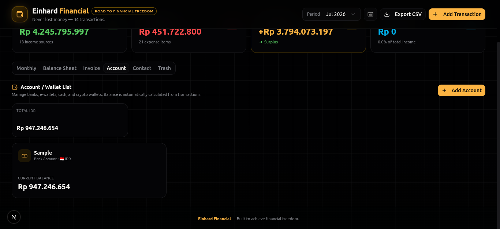
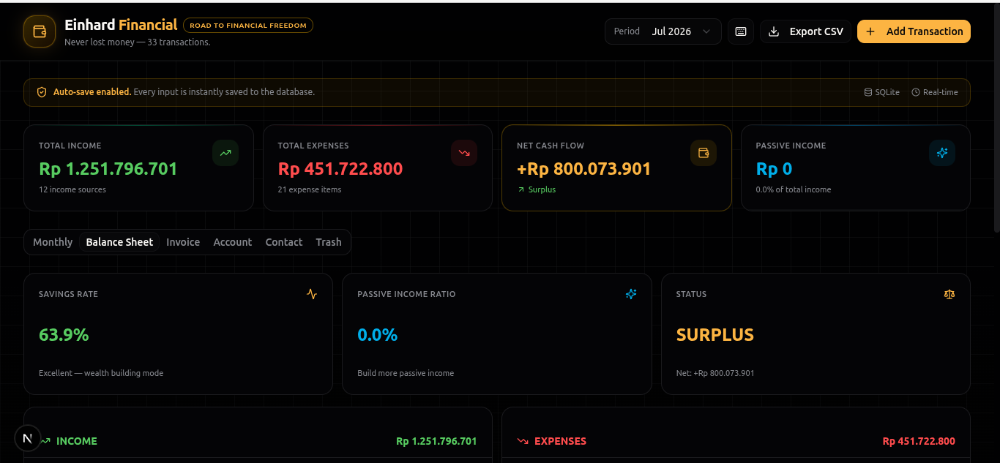
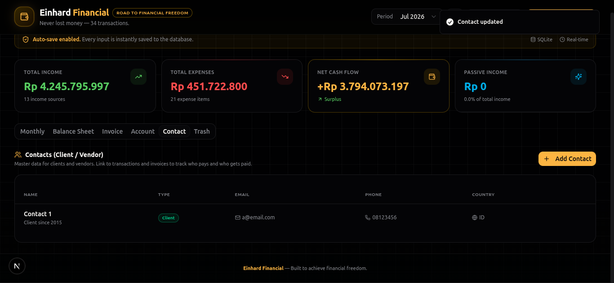
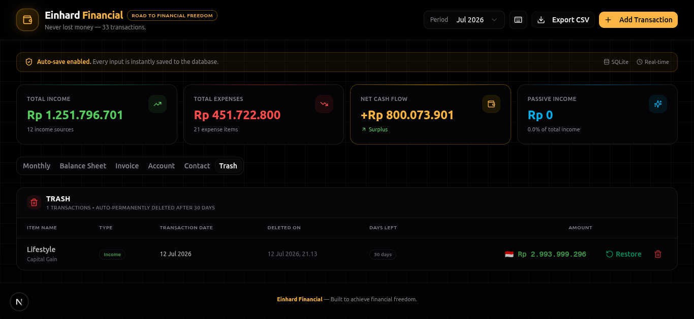

# Financial Tracker

A personal finance dashboard for tracking income, expenses, invoices, and multi-currency accounts in real time.

## Screenshoots









## Features

- **Real-time dashboard** — total income, expenses, net cash flow, and passive income at a glance
- **Multi-currency support** — track transactions in IDR, USD, or any currency with automatic conversion
- **Account management** — organize balances across bank accounts, e-wallets, cash, and crypto wallets
- **Invoicing** — create, send, and track invoice status (draft, sent, paid, overdue)
- **Contact management** — keep clients and vendors organized
- **Trend charts** — visualize income vs. expenses over the last 12 months
- **CSV export** — download your data for external use
- **Soft delete / trash** — restore accidentally deleted transactions

## Tech Stack

- **Framework:** Next.js (App Router) + TypeScript
- **Styling:** Tailwind CSS + shadcn/ui
- **Database:** SQLite via Prisma ORM
- **Package manager:** Bun

## Getting Started

### Prerequisites

Make sure you have the following installed:

- [Bun](https://bun.sh) (v1.0 or later)
- [Node.js](https://nodejs.org) (v18 or later)

### Installation

1. Clone the repository
   ```bash
   git clone https://github.com/einhard-moretti/Financial.git
   cd Financial/dashboard
   ```

2. Install dependencies
   ```bash
   bun install
   ```

3. Set up environment variables

   Create a `.env` file in the root of the project:
   ```
   DATABASE_URL="file:./db/custom.db"
   ```

4. Set up the database
   ```bash
   bunx prisma generate
   bunx prisma db push
   ```

5. (Optional) Seed the database with sample data
   ```bash
   bun run scripts/seed.ts
   ```

6. Start the development server
   ```bash
   bun run dev
   ```

7. Open [http://localhost:3000](http://localhost:3000) in your browser

## Project Structure

```
dashboard/
├── prisma/
│   └── schema.prisma       # database models
├── scripts/
│   └── seed.ts              # sample data generator
├── src/
│   ├── app/
│   │   ├── api/              # API routes (accounts, transactions, invoices, contacts)
│   │   └── page.tsx          # main dashboard page
│   ├── components/
│   │   ├── dashboard/        # dashboard-specific components
│   │   └── ui/                # shared UI components
│   ├── hooks/                # custom React hooks
│   └── lib/                  # database client and utilities
└── public/                   # static assets
```

## Data Model

The app is built around four core entities:

- **Account** — a place money lives (bank, e-wallet, cash, crypto)
- **Contact** — a client or vendor tied to transactions and invoices
- **Transaction** — a single income or expense entry, linked to an account and optionally a contact
- **Invoice** — a receivable tracked separately from transactions, with its own status workflow

## License

This project is open for reference and educational purposes.